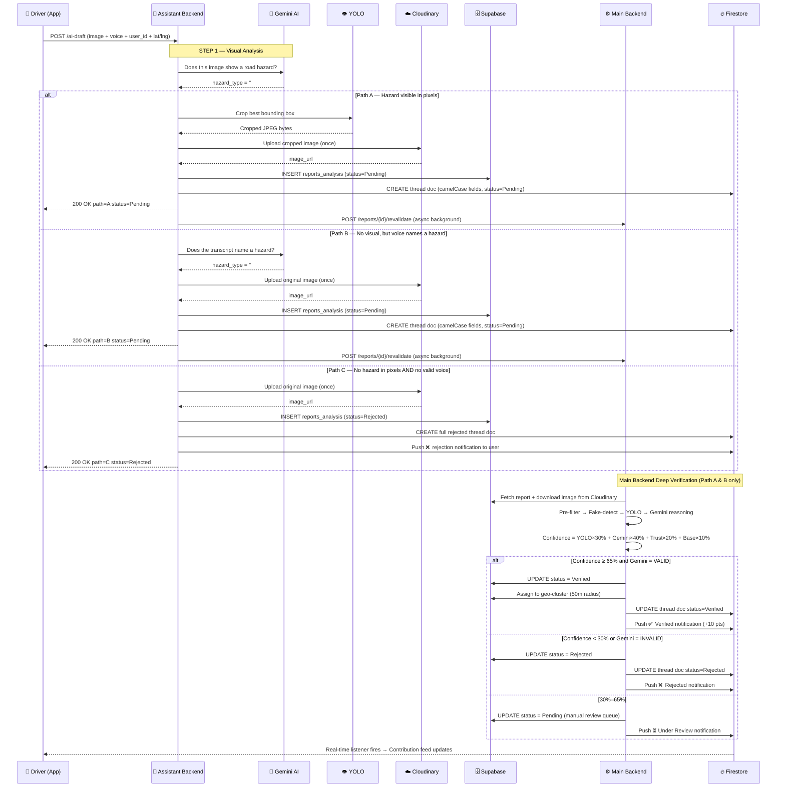

# AI Voice Reporting — Backend Architecture

This document details the end-to-end flow of the AI Voice Reporting system, from the driver's voice command to the live map and notifications. It also covers how manual reports differ from voice reports.

---

## Two Backends, One Pipeline

| Backend | Port | Role |
|---|---|---|
| **Assistant Backend** | `8001` | AI brain — classifies hazard, uploads image, writes Supabase + Firestore directly |
| **Main Backend** | `8000` | Auditor — deep YOLO + Gemini verification, trust scoring, cluster mapping |

Both backends communicate over `localhost` (same machine). The Android app only talks to the Assistant Backend for voice reports.

---

## Report Submission: Voice vs Manual

| | Voice Report (AI) | Manual Report (Form) |
|---|---|---|
| **Android sends to** | Assistant Backend `POST /api/v1/reports/ai-draft` | Main Backend `POST /api/v1/reports` |
| **Supabase written by** | ✅ Assistant Backend | ✅ Main Backend |
| **Firestore written by** | ✅ Assistant Backend | ✅ Android App (writes after getting UUID from backend) |
| **Image uploaded by** | ✅ Assistant Backend (to Cloudinary) | ✅ Main Backend (to Cloudinary) |
| **App does after submit** | Shows a Toast — nothing else | Writes Firestore doc using UUID from backend |
| **Verification** | Main Backend `/revalidate` (async, Path A/B only) | Main Backend background task |

---

## The Three Voice Paths

| Path | Trigger | Status | Firebase written by |
|---|---|---|---|
| **A — Visual** | Gemini sees a hazard in pixels | `Pending → Verified/Rejected` | Assistant Backend creates thread; Main Backend updates it |
| **B — Voice Fallback** | No visual hazard, but voice names one | `Pending → Verified/Rejected` | Assistant Backend creates thread; Main Backend updates it  |
| **C — Rejected** | No hazard in pixels AND no valid voice | `Rejected` | Assistant Backend creates full rejected thread + user notification |

---

## Firestore Thread Schema

The Assistant Backend writes Firestore documents at `reports/{channel}/threads/{report_id}`.  
Field names are written in **camelCase** to match the Android `Report.kt` data class:

```
id             → String   (UUID, same as Supabase report_id)
userId         → String
incidentType   → String   (e.g. "#pothole", "#accident")
description    → String
imageUrl       → String   (Cloudinary URL)
latitude       → Double
longitude      → Double
status         → String   ("Pending" or "Rejected")
pointsAwarded  → Int      (0 for Pending/Rejected)
hazardCondition→ String   ("active" for Pending, "none" for Rejected)
aiVerification → Map      {verified, confidence, reason}
createdAt      → Timestamp
```

> **Why camelCase matters**: If field names don't match `Report.kt`, the Firebase SDK silently returns
> an empty object and the report never appears in the Contribution feed.

---

## Full Voice Report Flow



---

## Key Design Decisions

1. **Firestore thread created before verification** — For Path A/B, the Assistant Backend writes the full thread document first. The Main Backend's `/revalidate` then does a `merge=True` update. Without this, the update would silently fail because Firestore would find no document to update.

2. **Zero redundant uploads** — Cloudinary is hit exactly once per report, inside the Assistant Backend. The Main Backend downloads from Cloudinary for analysis but never re-uploads.

3. **Driver is released instantly** — The Android app receives a `200 OK` from the Assistant Backend within seconds. All deep YOLO + Gemini verification happens in the background. The driver keeps driving.

4. **Path C is self-contained** — Reports with no hazard never reach the Main Backend, saving compute and keeping the verification queue clean.

5. **Supabase retry on 525 errors** — Cloudflare SSL errors on Supabase's CDN nodes (`Error 525`) are transient. `_insert_report` retries up to 3× with 1-second backoff before giving up.

6. **localhost for inter-backend calls** — `MAIN_BACKEND_URL=http://localhost:8000` (not the LAN IP). Both backends run on the same machine; using localhost avoids network routing failures when the LAN IP changes.

---

## Device-Side Pre-processing

Before the Android app sends a `POST /ai-draft` request, several critical steps occur to ensure data quality and system stability:

1.  **Microphone Conflict Management**: To prevent Android from silencing the input stream, the app explicitly stops the background `WakeWordService` (Porcupine) before initiating the `SpeechRecognizer`. This releases the hardware lock on the microphone.
2.  **Graceful Recovery**: Once transcription is complete (or if an error occurs), the `WakeWordService` is automatically restarted to resume background "Hey Mapzy" listening.
3.  **UI Feedback Loop**: The voice button initiates a non-clipped pulsing animation only when the `SpeechRecognizer` is in the `onReadyForSpeech` state, ensuring the user knows exactly when to start talking.
4.  **Error Filtering**: Internal Android speech errors (e.g. `ERROR_CLIENT`) are filtered out, while user-actionable errors (e.g. `ERROR_NO_MATCH`) are surfaced as friendly toasts to guide the driver.
