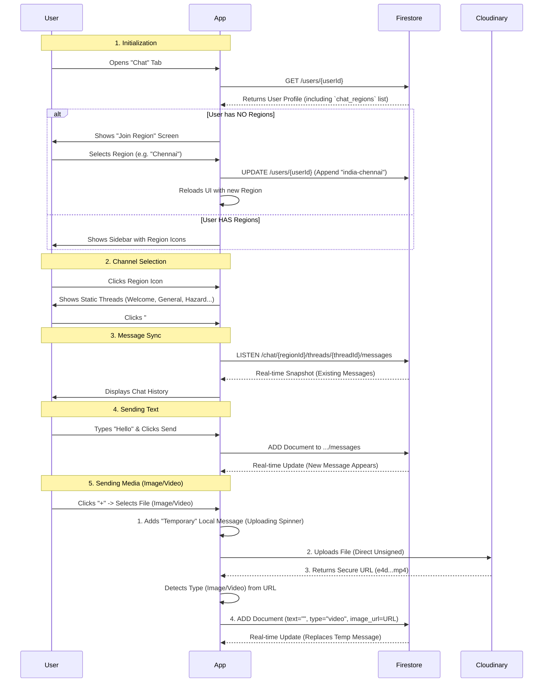

# ZWAP Chat Architecture

## 1. Chat "Working" Flowchart (Logic)
This sequence diagram shows how the app initializes, joins regions, and syncs messages in real-time.



## 2. Storage Flowchart (Data Hierarchy)
This diagram shows exactly how data is nested and stored in Firestore.

```mermaid
graph TD
    classDef col fill:#f9f,stroke:#333;
    classDef doc fill:#ccf,stroke:#333;
    classDef field fill:#eee,stroke:#333;

    Root[Firestore Root] --> Users(Users Collection):::col
    Root --> Chat(Chat Collection):::col

    %% Users Branch
    Users --> UserDoc(User Document {uid}):::doc
    UserDoc --> UFields["Fields:
    - username
    - email
    - chat_regions [array]"]:::field

    %% Chat Branch (Renamed from Regions)
    Chat --> RegionDoc(Region Document {regionId}):::doc
    RegionDoc --> Threads(Threads Subcollection):::col
    Threads --> ThreadDoc(Thread Document {threadId}):::doc
    ThreadDoc --> Messages(Messages Subcollection):::col
    Messages --> MsgDoc(Message Document {msgId}):::doc
    MsgDoc --> MFields["Fields:
    - text
    - type ('text'/'image')
    - user_id
    - username
    - created_at"]:::field

    subgraph "Legacy (Unused)"
    Channels[Channels Coll]
    GlobalMsgs[Messages Coll]
    end
```
