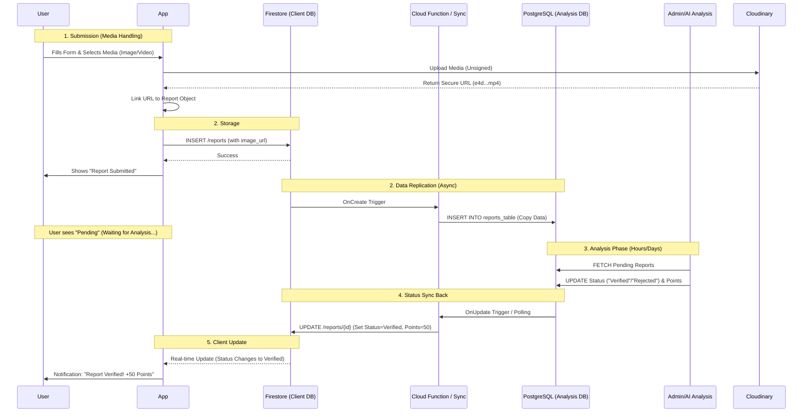

# Contribution & Reporting Architecture

## 1. Database Structure (Schema)

Since the app currently uses Firebase, we will store the raw reports in a `reports` collection.
*To support "SQL analysis" later, we structure the data flatly and consistently, making it easy to export to BigQuery or a SQL server.*

### Table/Collection: `reports` (Firestore)
| Field Name | Type | Description |
| :--- | :--- | :--- |
| `report_id` | String (UUID) | Unique Primary Key |
| `user_id` | String | Foreign Key (Link to User) |
| `incident_type` | String | e.g. "Accident", "Pothole", "Traffic" |
| `description` | String | User's detailed text |
| `severity` | Integer | 1 (Low) to 5 (Critical) |
| `latitude` | Double | GPS Lat |
| `longitude` | Double | GPS Lng |
| `image_url` | String | Proof (Cloudinary URL) |
| `status` | String | "Pending", "Verified", "Rejected" |
| `points_awarded` | Integer | Points (initially 0, updated by Sync) |
| `created_at` | Timestamp | When it happened |

### SQL Schema (PostgreSQL Analysis DB)
*This table mirrors the Firestore data for analytical queries.*

```sql
CREATE TABLE reports_analysis (
    report_id VARCHAR(64) PRIMARY KEY, -- Matches Firestore ID
    user_id VARCHAR(64) NOT NULL,
    incident_type VARCHAR(50),
    description TEXT,
    severity INT,
    geo_location GEOMETRY(Point, 4326), -- PostGIS for spatial analysis
    image_url TEXT,
    status VARCHAR(20) DEFAULT 'Pending',
    created_at TIMESTAMP DEFAULT CURRENT_TIMESTAMP
);
```

### Data Mapping (Firestore -> SQL)
| Firestore Field | SQL Column | Notes |
| :--- | :--- | :--- |
| `report_id` | `report_id` | Direct Copy |
| `user_id` | `user_id` | Direct Copy |
| `incident_type` | `incident_type` | Direct Copy |
| `latitude`, `longitude` | `geo_location` | Converted to PostGIS Point(lng, lat) |
| `status` | `status` | Syncs both ways |
| `created_at` | `created_at` | Converted to SQL Timestamp |

---

## 2. Process Flowchart



## 3. Implementation Steps
1.  **Create "Contribution" Screen**: A list showing *User's* past reports.
2.  **Create "Add Report" Form**: Inputs for Type, Location, Image.
3.  **Backend Logic**: Save to Firestore `reports` collection.
4.  **Privacy**: Ensure query uses `whereEqualTo("user_id", uid)`.
