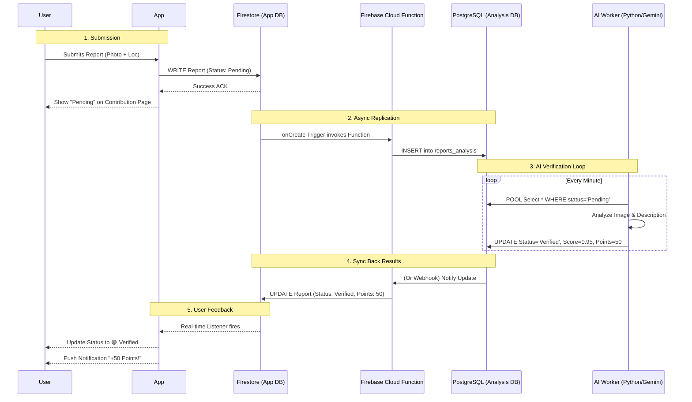

# Contribution & Reporting Architecture

This document details the end-to-end architecture for the Contribution system, from user submission to AI verification via PostgreSQL.

## 1. User Interface (Contribution Page)
The **Contribution Fragment** serves as the user's personal dashboard for their activity.
*   **List View**: Displays a real-time feed of the user's submitted reports.
*   **Status Indicators**:
    *   🟡 **Pending**: Report submitted, waiting for AI verification.
    *   🟢 **Verified**: AI/Admin has confirmed the hazard. (+Points)
    *   🔴 **Rejected**: Report marked as invalid or spam. (-Points)
*   **Data Source**: Reads directly from Firestore `reports` collection (filtered by `user_id`).

## 2. Database Schema

### A. Firestore (Client Database)
*Optimized for mobile read/write speeds.*
*   **Path**: `reports/{channel_id}/threads/{report_id}`
*   **Fields**:
    *   `report_id`: UUID
    *   `user_id`: Link to User
    *   `incident_type`: e.g. "Pothole"
    *   `image_url`: Cloudinary Link
    *   `location`: { lat, lng }
    *   `status`: "Pending" (Default)
    *   `points_awarded`: 0

### B. PostgreSQL (Analysis Database)
*Optimized for AI processing and complex queries.*
*   **Table**: `reports_analysis`
    *   `report_id` (Primary Key)
    *   `user_id`
    *   `incident_type`
    *   `description`
    *   `image_url`
    *   `verification_confidence` (Decimal, 0-1.0)
    *   `ai_reasoning` (Text)
    *   `status`
    *   `points`

---

## 3. The "Sync & Verify" Process Flow

## 4. Why This Architecture?
1.  **Speed**: The mobile app NEVER talks to PostgreSQL or the AI directly. It only talks to Firestore, so the UI is instant.
2.  **Scalability**: The heavy AI processing happens in the background. If 10,000 users submit reports at once, the queue builds up in Postgres, but the app doesn't crash.
3.  **Cost**: Syncing is cheap. You only run expensive AI processing on the backend, not on the user's device.
