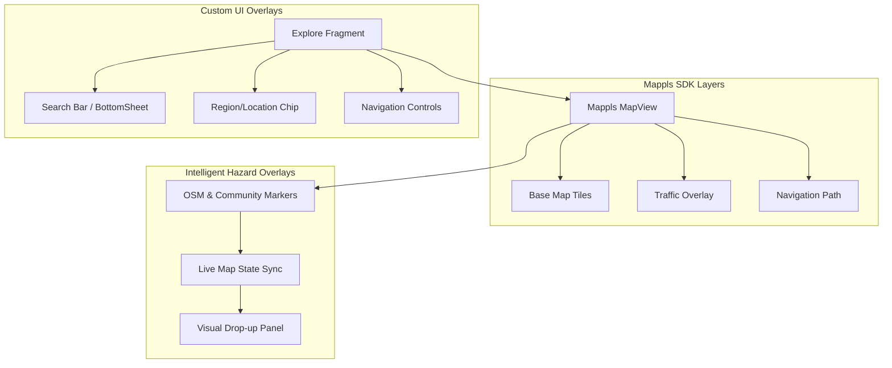
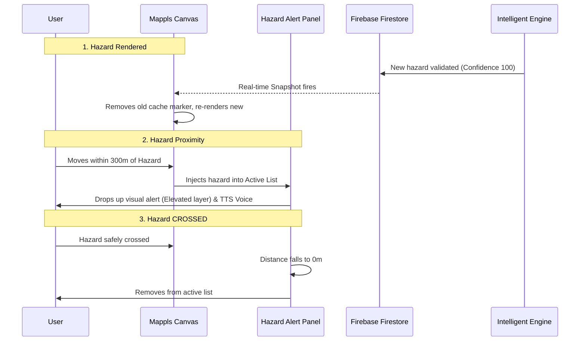

# Explore Architecture Flowchart (Mappls Integration)

This flowchart details the architecture and logic of the "Explore" tab, focusing on the Map implementation, Search functionality, and the Intelligent Hazard Engine overlays.

## 1. Map Initialization & Layering

## 2. Dynamic Component Updating

