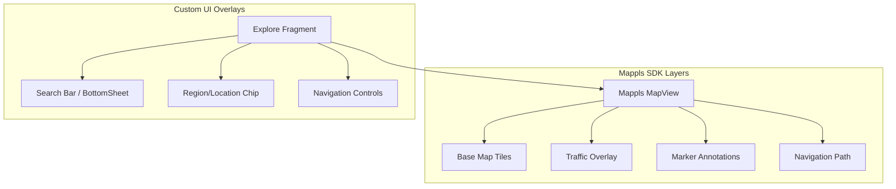
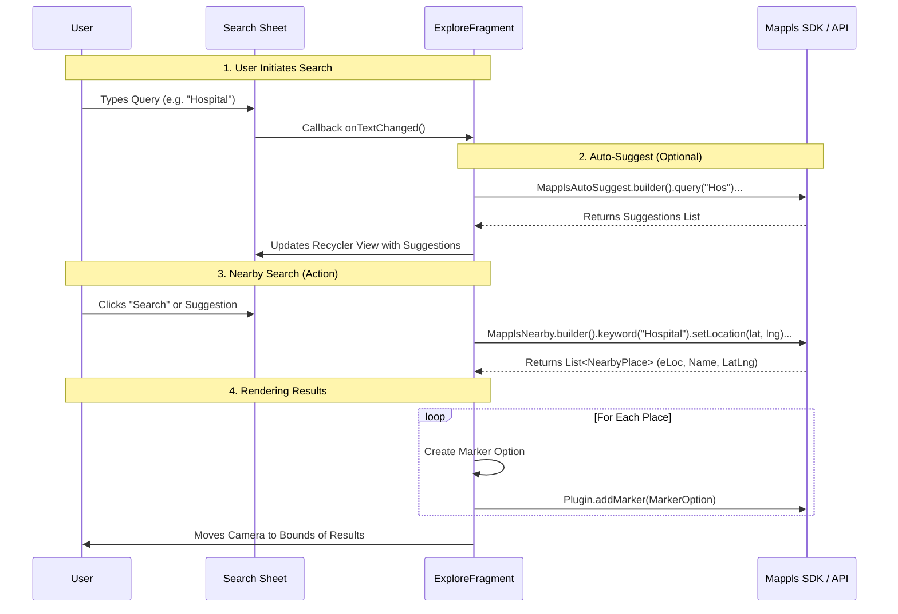

# Explore Architecture Flowchart (Mappls Integration)

This flowchart details the architecture and logic of the "Explore" tab, focusing on the Map implementation and Search functionality.

## 1. Map Initialization & Layering

## 2. Search & Nearby API Flow

