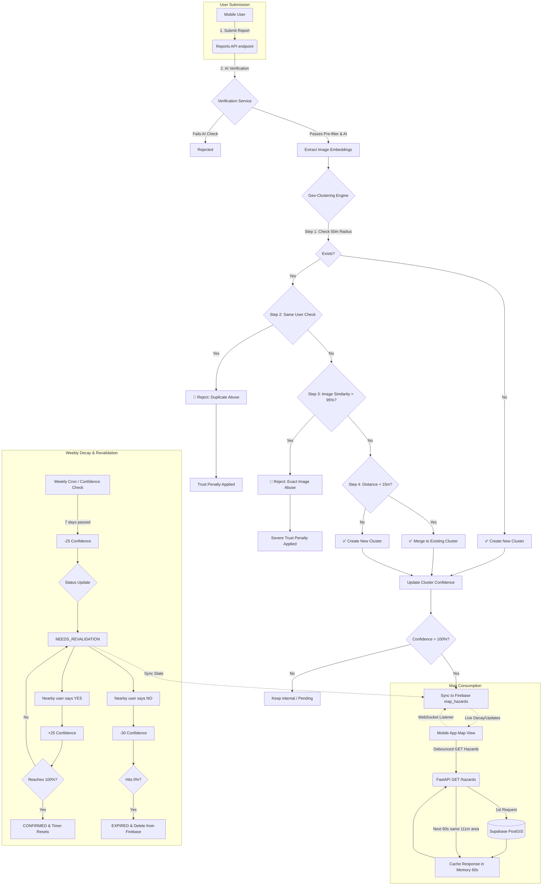

# Intelligent Hazard Clustering & Map Sync Architecture

This document outlines the architecture, data flow, and lifecycle of a hazard report within the DeepBlueS11 platform. The engine is designed to intelligently handle duplicate reports, protect against farming abuse, continuously update the map with decaying hazard confidences, and optimally cache map requests for high scalability.

## Architecture & Data Flow

## Core Components

### 1. Geo-Clustering Engine (`geo_clustering.py`)
Responsible for grouping similar reports based on strict spatial rules (50m search radius, 15m merge rule) to prevent map clutter.

### 2. Anti-Farming & Trust Logic (`anti_farming.py` & `trust.py`)
Prevents users from intentionally farming reward points by analyzing velocity (e.g. 4 reports within 50m in 10 minutes) and rejection rates. Applies dynamic trust penalties, and users with a score below 20.0 are shadow-banned, stripping their community voting rights.

### 3. Confidence Decay Loop (`confidence.py`)
Clusters start at `PENDING`. When they reach 100% confidence via multiple accepted reports, they become `CONFIRMED`.
If a `CONFIRMED` hazard exists unchallenged for a full week (7 days), its confidence automatically decays by 25 points, putting it in a `NEEDS_REVALIDATION` state to solicit user consensus. 

### 4. Hybrid Map Architecture
The map rendering relies on two optimized systems working in tandem:
1. **Supabase (PostGIS) + TTLCache**: The app makes a `GET /hazards` request to pull markers using precise Radius filters. The backend rounds coordinates to a 111-meter precision box and caches the database result in memory for 60 seconds. This blocks database spam.
2. **Firebase live syncing (`firebase_sync.py`)**: Real-time Firebase listeners wait for the `map_hazards` collection documents to change (e.g., decaying confidence color changes), updating active app screens immediately without a full refresh. Expired hazards are strictly deleted from this collection.
