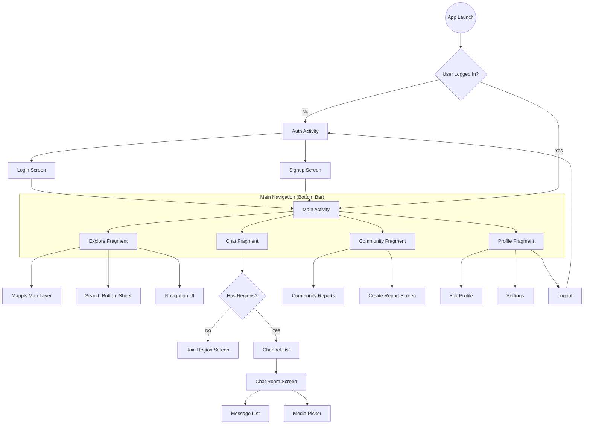

# ZWAP Application Overview Flowchart

This flowchart represents the high-level user journey and navigation flow within the ZWAP application.

```mermaid
graph TD
    Start((App Launch)) --> AuthCheck{User Logged In?}
    
    %% Authentication Flow
    AuthCheck -- No --> AuthScreen[Auth Activity]
    AuthScreen --> Login[Login Screen]
    AuthScreen --> Signup[Signup Screen]
    Login --> MainApp
    Signup --> MainApp
    
    %% Main Application Flow
    AuthCheck -- Yes --> MainApp[Main Activity]
    
    subgraph "Main Navigation (Bottom Bar)"
        MainApp --> ExploreTab[Explore Fragment]
        MainApp --> ChatTab[Chat Fragment]
        MainApp --> CommunityTab[Community Fragment]
        MainApp --> ProfileTab[Profile Fragment]
    end
    
    %% Explore Tab Details
    ExploreTab --> MapView[Mappls Map Layer]
    ExploreTab --> SearchSheet[Search Bottom Sheet]
    ExploreTab --> Navigation[Navigation UI]
    
    %% Chat Tab Details
    ChatTab --> RegionSelect{Has Regions?}
    RegionSelect -- No --> JoinRegion[Join Region Screen]
    RegionSelect -- Yes --> ChannelList[Channel List]
    ChannelList --> ChatRoom[Chat Room Screen]
    ChatRoom --> MsgList[Message List]
    ChatRoom --> MediaPick[Media Picker]
    
    %% Community Tab Details
    CommunityTab --> ReportList[Community Reports]
    CommunityTab --> CreateReport[Create Report Screen]
    
    %% Profile Tab Details
    ProfileTab --> EditProfile[Edit Profile]
    ProfileTab --> Settings[Settings]
    ProfileTab --> Logout[Logout]
    Logout --> AuthScreen
```
