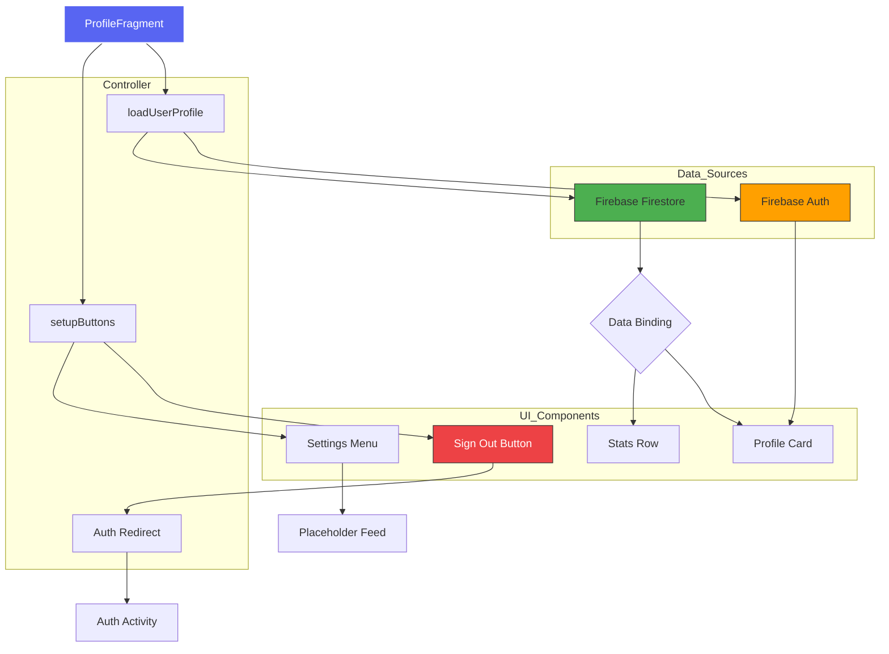

# Profile Page Architecture

This diagram visualizes the data flow, UI components, and logic handling for the **Profile ("You") Fragment**.

### **Architectural Breakdown**

1.  **View Layer (XML)**: Uses `CardView` for elevation and grouping. The primary themes are dark (#202225) with premium blue/red accents for actions.
2.  **Data Persistence**: 
    *   `Firebase Auth` manages the session local state.
    *   `Firestore` serves as the single source of truth for gamified stats (Points/Reports).
3.  **Controller Logic**: 
    *   **Atomic Loading**: Fetches Auth and Stats simultaneously on entry.
    *   **Secure Logouts**: Uses `Intent.FLAG_ACTIVITY_CLEAR_TASK` to prevent users from seeing cached data after logout.
