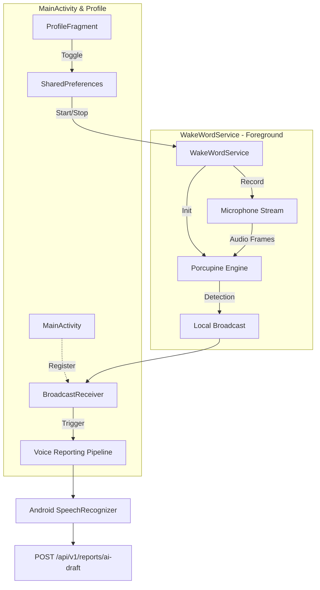

# Wake Word Detection ("Hey Mapzy")
    
This document describes the implementation of the offline wake-word detection system in the Mapzy (ZWAP) mobile application.

## Overview

The "Hey Mapzy" feature allows users to trigger the voice-reporting pipeline hands-free. It uses the **Picovoice Porcupine SDK**, an on-device, low-latency, and privacy-focused wake-word engine.

## System Architecture

## Core Components

### 1. `WakeWordService.kt`
*   **Foreground Service**: Runs continuously to ensure the microphone stays active even in the background.
*   **Mic Access**: Declared with `foregroundServiceType="microphone"` to comply with Android 14+ (API 34) security requirements.
*   **Porcupine Engine**: Processes audio locally using the `hey-map-zee_en_android_v4_0_0.ppn` model.

### 2. `MainActivity.kt`
*   **Receiver**: Listens for `ACTION_WAKE_WORD_DETECTED`.
*   **Pipeline Activation**: When detected, it programmatically triggers `launchVoiceReporter()`, the same method used by the manual UI button.
*   **Self-Healing**: Re-starts the service in `onResume` if the user has enabled the feature.

### 3. `ProfileFragment.kt`
*   **Feature Control**: Provides a toggle switch to enable/disable the background listener.
*   **Permission Safety**: Checks for `RECORD_AUDIO` before allowing the service to start, preventing crashes on newer Android versions.

## Configuration Details

| Parameter | Value |
| :--- | :--- |
| **Wake Word** | "Hey Mapzy" |
| **SDK** | Picovoice Porcupine 4.0.0 |
| **Sensitivity** | 0.65 |
| **Model File** | `assets/hey-map-zee_en_android_v4_0_0.ppn` |
| **Detection Type** | 100% Offline |

## Android 14 (API 34) Compliance

To support Android 14+, the following measures were implemented:
1.  **Permission**: `FOREGROUND_SERVICE_MICROPHONE` added to Manifest.
2.  **Service Type**: `startForeground()` explicitly includes the microphone type.
3.  **Lifecycle**: `ActivityResultLauncher` registration moved to `onCreate()` to avoid illegal state exceptions.
